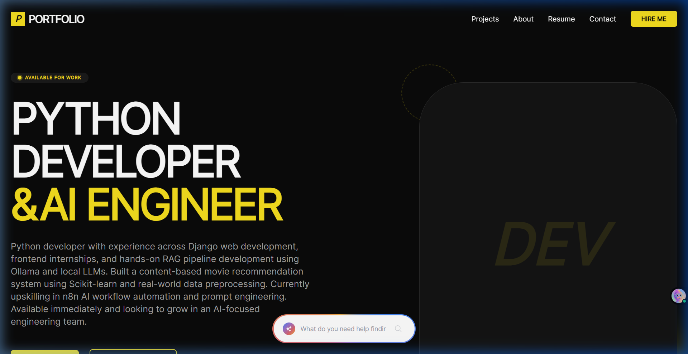
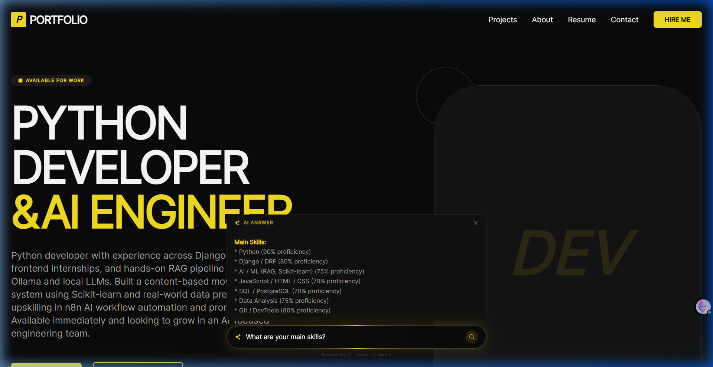

# 🚀 Modern Portfolio Website with RAG AI Search

A dark-themed, premium portfolio website built with a modern tech stack. It showcases projects, experience, education, and skills, and features an integrated **Retrieval-Augmented Generation (RAG) AI assistant** at the bottom of the screen. Visitors can naturally query the portfolio data, and the assistant accurately and strictly responds using your database content powered by **LangChain** and **ChatGroq Llama 3.3**.



---

## ✨ Features

- **Google Gemini-Style AI Search Bar:** A floating bottom-center AI search that parses natural language questions concerning the portfolio. Uses a dynamic rotating conic-gradient ("running light") border that glows intensely on focus.
- **RAG Powered by LangChain:** Grounded AI generation that strictly adheres to the database models. Refuses off-topic questions, eliminating hallucinations.
- **Dynamic Content:** All information including profile, projects, skills, education, and experiences are populated dynamically from the Django backend.
- **Modern UI/UX:** Built using React and Tailwind CSS v3, utilizing smooth Framer Motion animations.
- **Responsive Layout:** Beautiful across mobile, tablet, and desktop viewports.
- **Dark Mode Aesthetic:** Highly tailored dark theme with sleek yellow (`#f7df1e`) accents and micro-animations.



---

## 🛠️ Tech Stack

### Frontend
- **React.js (Vite)** – Fast, modular UI rendering.
- **Tailwind CSS v3** – Utility-first CSS framework for custom, premium styling.
- **Framer Motion** – Production-ready animation library for React.
- **React Router DOM** – Elegant client-side routing.
- **React Icons** – High-quality scalable vector icons.

### Backend
- **Django & Django REST Framework (DRF)** – Robust and secure RESTful backend API.
- **SQLite3 / PostgreSQL** – Flexible relational database support.
- **LangChain & LangChain Core** – Integration framework for managing the RAG pipeline.
- **ChatGroq API (Llama-3.3-70b)** – Ultra-fast Large Language Model inferencing.
- **Python Decouple** – Secure handling of environment variables.

---

## 🚀 Getting Started

Follow these steps to set up the development environment locally.

### 1. Backend Setup (Django API)
1. Open a terminal and navigate to the backend directory:
   ```bash
   cd backend
   ```
2. Create and activate a Python virtual environment:
   ```bash
   python -m venv venv
   # On Windows:
   venv\Scripts\activate
   # On macOS/Linux:
   source venv/bin/activate
   ```
3. Install dependencies:
   ```bash
   pip install -r requirements.txt
   ```
4. Create a `.env` file in the `backend/` directory by copying the sample structure:
   ```env
   # backend/.env
   GROQ_API_KEY=your_chatgroq_llama_key_here
   ```
5. Apply database migrations:
   ```bash
   python manage.py makemigrations
   python manage.py migrate
   ```
6. Create a superuser to access the Django admin panel and populate your portfolio data:
   ```bash
   python manage.py createsuperuser
   ```
7. Start the backend development server:
   ```bash
   python manage.py runserver
   ```
   > The backend API will typically run on `http://127.0.0.1:8000/`. You can visit `http://127.0.0.1:8000/admin/` to log in and start adding your skills, projects, and profile data!

### 2. Frontend Setup (React App)
1. Open a new terminal and navigate to the frontend directory:
   ```bash
   cd frontend
   ```
2. Install npm dependencies:
   ```bash
   npm install
   ```
3. Start the Vite development server:
   ```bash
   npm run dev
   ```
   > The frontend will typically run on `http://localhost:5173/`. Ensure the backend server is running simultaneously so the API endpoints function correctly.

---

## 🤖 AI Search Integration Instructions
To ensure the AI strictly answers from your portfolio content without hallucinating:
1. Ensure your `GROQ_API_KEY` is completely configured in the backend `.env`.
2. Fully populate your `Profile`, `Skill`, `Experience`, `Education`, and `Project` records in the Django Admin portal. The AI directly uses this data as its source of truth.
3. Access the website, hit the hotkey `/` to focus the floating bot, and type: _"What are your main skills?"_ to see it working perfectly.

---

## 🤝 Contributing
Contributions, issues, and feature requests are welcome! Feel free to check the issues page.

## 📝 License
This project is [MIT](LICENSE) licensed.
